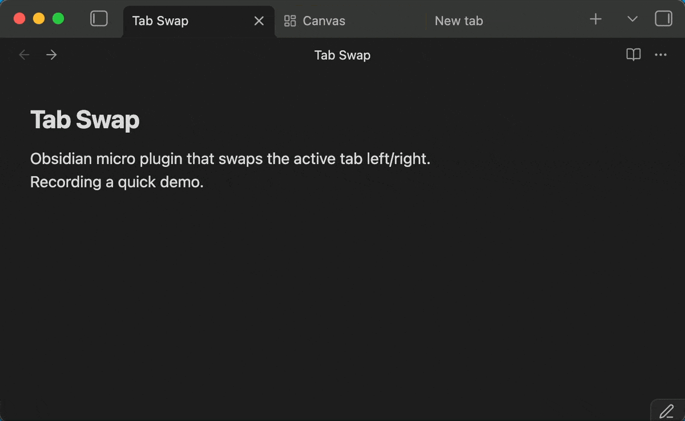

# Tab Swap

Obsidian micro plugin that swaps the active tab left/right.

Assign whatever hotkeys you like.

| Action               | Command ID         | My setup (macOS) |
| -------------------- | ------------------ | --------------- |
| Go to previous tab   | `go-to-previous-tab` (built-in) | ⌘⌥← |
| Go to next tab       | `go-to-next-tab` (built-in)     | ⌘⌥→ |
| Swap Tab Left        | `swap-tab-left`                 | ⌘⌥⇧← |
| Swap Tab Right       | `swap-tab-right`                | ⌘⌥⇧→ |
